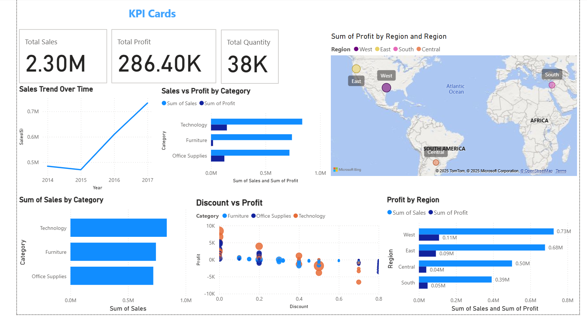

# 📊 E-Commerce Sales Performance Dashboard (Power BI)

## 📝 Project Overview
This project analyzes sales and profitability trends from an e-commerce dataset (Sample Superstore) to help leadership make data-driven decisions.  
The dashboard was created in **Power BI** and explores customer, product, regional, and discount performance.

---

## 🎯 Business Questions
1. How have sales evolved over time (2014–2017)?
2. Which product categories drive the most sales and profit?
3. Which regions are most/least profitable?
4. How do discounts affect profitability?

---

## 🔑 Key Insights
- 📈 **Sales Growth**: After a slight dip in 2015, sales grew strongly in 2016–2017, reaching ~$0.72M.  
- 🛋️ **Furniture Weakness**: Furniture generates significant revenue but struggles with profitability.  
- 🌍 **Regional Differences**: The **West region** is most profitable, while **Central and South** lag behind.  
- 💸 **Discount Trap**: High discounts (>40%) often lead to negative profit margins — large orders with deep discounts are especially unprofitable.

---

## 💡 Recommendations
- **Optimize Discounts**: Reduce or cap discounts, especially on low-margin products like Furniture.  
- **Regional Strategy**: Strengthen focus on the West (highest returns) and investigate strategies to improve performance in South and Central regions.  
- **Category Focus**: Continue investing in Technology (highest sales + profit) while reviewing cost structure for Furniture.  
- **Seasonality**: Capitalize on holiday sales peaks by aligning promotions with profitable products rather than deep discounts.  

---

## 📊 Dataset
The dataset used in this project is the [Superstore Dataset (Final)](https://www.kaggle.com/datasets/vivek468/superstore-dataset-final?resource=download) available on **Kaggle**.  
It contains detailed information on orders, sales, profit, discounts, and customer demographics between 2014–2017.

---

## 📂 Project Files
- `Ecommerce_Dashboard.pbix` → Power BI file with interactive dashboard.  
- `screenshots/` → PNG images of the dashboard.  
- `README.md` → This documentation.  

---

## 📸 Dashboard Preview
  
*(Replace with your actual screenshot file name.)*  

---

## 🛠️ Tools & Skills Used
- Power BI (data modeling, visualization, DAX basics)  
- Data cleaning and transformation  
- Business analysis and storytelling  

---

## 🔧 How to Open
1. Download `Ecommerce_Dashboard.pbix`.  
2. Open with **Power BI Desktop** (latest version recommended).  

---

## 🧭 Notes
- Large `.pbix` files are tracked via **Git LFS** for efficient storage and download.  
